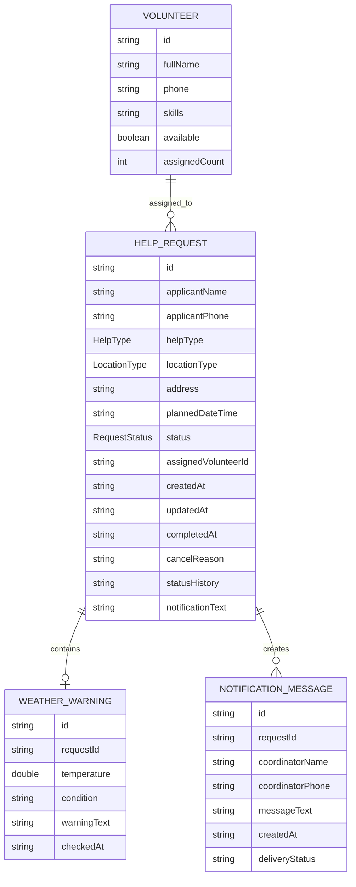

# task2_1. DFD и CRUD-анализ

Проект: ПС «Организация волонтерской помощи»

Источник задания: [task2_1.md](https://github.com/olgmina/SWEngineering-technics.github.io/blob/gh-pages/2_Design/task2_1.md)

## 1. DFD уровня 0

## 2. DFD уровня 1

Хранилища на DFD показаны как логические группы данных. В физическом JSON-файле `WeatherWarning` хранится внутри соответствующей записи `HelpRequest` в поле `weatherWarning`, а не в отдельном top-level массиве.

## 3. DFD уровня 2

### 3.1 Декомпозиция процесса «3. Назначить волонтера»

### 3.2 Декомпозиция процесса «5. Проверить просрочки»

## 4. Информационная модель

История статусов не выделяется в отдельную сущность ER-модели. Она хранится как атрибут `statusHistory` внутри сущности `HelpRequest`, поэтому отдельного DFD-хранилища `D5 История статусов` и отдельной строки `StatusHistory` в CRUD-матрице нет.

## 5. CRUD-матрица

| Сущность | Create | Read | Update | Delete | Функции |
| --- | --- | --- | --- | --- | --- |
| HelpRequest / Заявка | + | + | + | - | обработать заявки, назначить волонтера, проверить просрочки, показать фильтры, вести встроенную историю статусов |
| Volunteer / Волонтер | + | + | + | + | управлять волонтерами, назначить волонтера, показать фильтры |
| WeatherWarning / Погодное предупреждение | + | + | + | - | проверить погоду, обработать заявки |
| NotificationMessage / Уведомление | + | + | - | - | сформировать уведомление, показать уведомления |

## 6. Спецификация функций

| Функция DFD уровня 1 | Входные данные | Выходные данные | CRUD-операции |
| --- | --- | --- | --- |
| 1. Обработать заявки | данные заявки, команда редактирования/отмены/завершения | заявка, карточка заявки, новый статус | HelpRequest C/R/U |
| 2. Управлять волонтерами | ФИО, телефон, навыки, доступность | запись волонтера | Volunteer C/R/U/D |
| 3. Назначить волонтера | выбранная заявка, выбранный волонтер | заявка в статусе «В работе» | HelpRequest R/U, Volunteer R/U |
| 4. Проверить погоду | адрес и тип места заявки | погодное предупреждение или пустой результат | HelpRequest R/U, WeatherWarning C/R/U |
| 5. Проверить просрочки | список новых заявок, текущая дата | просроченные заявки | HelpRequest R/U |
| 6. Сформировать уведомление | данные просроченной заявки, координатор | текст сообщения координатору | NotificationMessage C/R, HelpRequest U |
| 7. Показать статистику и фильтры | статус, тип помощи, дата, волонтер, поисковая строка | отфильтрованный список, счетчики | HelpRequest R, Volunteer R, NotificationMessage R |

Примечание: операции изменения истории статусов выполняются как обновление атрибута `statusHistory` сущности `HelpRequest`.

## 7. Согласование с информационной моделью

| Проверка | Статус | Комментарий |
| --- | --- | --- |
| Каждое хранилище DFD соответствует сущности ER | Да | D1 соответствует HelpRequest, D2 Volunteer, D3 WeatherWarning, D4 NotificationMessage; D3 является логической группой, физически вложенной в HelpRequest |
| Каждая сущность ER имеет хотя бы одну CRUD-операцию | Да | Все сущности используются в CRUD-матрице |
| Нет функций, работающих с несуществующими сущностями | Да | Все функции используют сущности модели приложения |
| Нет хранилищ, связанных напрямую без процесса | Да | Все потоки проходят через процессы DFD |
| CRUD-операции покрыты функциями DFD | Да | Для каждой операции указана функция-исполнитель |
| История статусов согласована с моделью хранения | Да | `statusHistory` хранится внутри HelpRequest и обновляется через операции HelpRequest U |

## 8. Трассировка требований

| Требование | Use case | Процесс DFD | Сущности |
| --- | --- | --- | --- |
| FR-01 | UC-01 | 1. Обработать заявки | HelpRequest |
| FR-07, FR-08 | UC-02 | 3. Назначить волонтера | HelpRequest, Volunteer |
| FR-11, FR-12 | UC-04 | 5. Проверить просрочки | HelpRequest |
| FR-13 | UC-04 | 6. Сформировать уведомление | NotificationMessage, HelpRequest |
| FR-14, FR-15 | UC-01 | 4. Проверить погоду | WeatherWarning, HelpRequest |
| FR-20 - FR-24 | UC-02, UC-04 | 7. Показать статистику и фильтры | HelpRequest, Volunteer |
